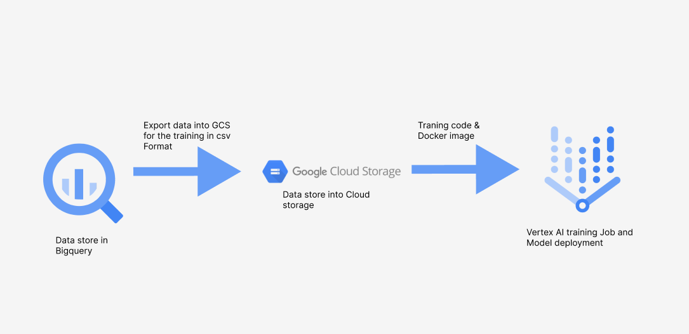

```markdown
### 🚕 TaxiFare Prediction with TensorFlow & Vertex AI

This project leverages Google Cloud's Vertex AI platform to build, train, and deploy a Deep Neural Network (DNN) model for predicting New York City taxi fares. The model utilizes features derived from pickup/drop-off coordinates, distance, and passenger count. The end-to-end pipeline involves data extraction from BigQuery, preprocessing, model training using TensorFlow, and deployment on Vertex AI for scalable real-time inference.

## ⚙️ Architecture

The architecture of this project follows these key steps:

1.  **Data store in BigQuery:** The NYC Taxi Fare dataset resides in Google BigQuery.
2.  **Export data into GCS for training in CSV Format:** Data is exported from BigQuery into Google Cloud Storage (GCS) in CSV format for training.
3.  **Training code & Docker image:** Training code, along with any necessary dependencies, is containerized into a Docker image. This image is then used by Vertex AI for training.
4.  **Vertex AI Training Job and Model deployment:** Vertex AI is used to run the training job using the data in GCS and the Docker image. Once trained, the model is deployed on Vertex AI for serving predictions.



## 📊 Dataset

The NYC Taxi Fare dataset, stored in Google Cloud Storage (GCS), includes the following features:

* Pickup and drop-off latitude/longitude
* Datetime of trip
* Passenger count
* Fare amount (target variable)

## 🧪 Feature Engineering

The following feature engineering techniques are applied to the raw data:

### ✅ Scaling

* Longitude is scaled from $[-78, -70]$ to $[0, 1]$.
* Latitude is scaled from $[37, 45]$ to $[0, 1]$.

### 📏 Distance Calculation

* The Euclidean distance between pickup and drop-off coordinates is calculated.

### 🗺️ Bucketization

* Scaled latitude and longitude values are discretized into spatial bins.

### ✖️ Feature Crossing

* Pickup and drop-off location features are crossed using `HashedCrossing`.
* The process is: `pickup_cross dropoff → embedding → flatten`.

### 🔎 Embedding

* High-cardinality hashed cross features are converted into low-dimensional dense representations (10-dimensional vectors).

## 🧠 Model Architecture

The TensorFlow model architecture consists of the following layers:

```
Input → Feature Transform (Lambda, Discretization, HashedCrossing, Embedding) → Concatenate → Dense Layers → Output (Fare)
```

## 🚀 Deployment

The trained model is exported in the `SavedModel` format and deployed on **Google Vertex AI**:

* The `SavedModel` is uploaded to Google Cloud Storage (GCS).
* A Vertex AI Endpoint is created to serve the model for scalable, real-time predictions.
* Predictions can be accessed via a REST API or the Google Cloud SDK.
```